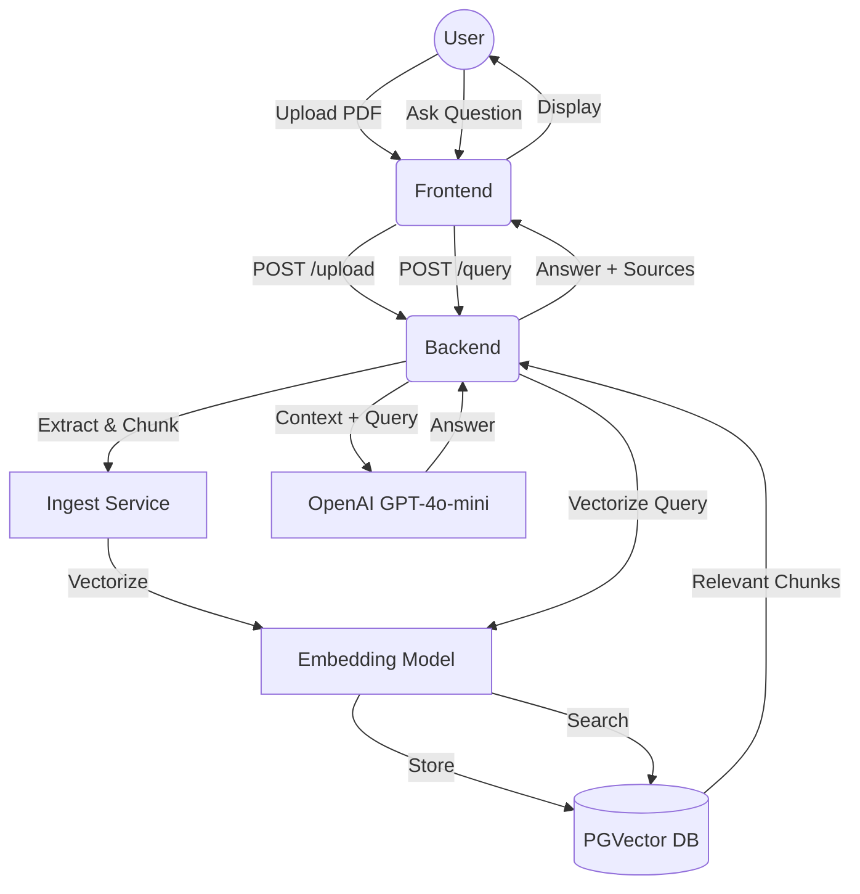

# RAG Engine: Technical Documentation

This document provides a detailed breakdown of the RAG (Retrieval-Augmented Generation) Engine, explaining every step of the process from document ingestion to AI-powered querying.

## System Overview

The RAG Engine allows users to upload PDF documents and ask questions based on their content. It uses a **Retrieval-Augmented Generation** architecture to ensure that the AI's answers are grounded in the specific data provided by the user.

---

## 1. Frontend Architecture (Next.js & React)

The frontend is built with **Next.js** and focuses on providing a clean, responsive interface for document management and chat.

### Key Components:
- **`page.tsx`**: The main application entry point.
- **State Management**: Uses React's `useState` to track:
    - `messages`: The conversation history.
    - `uploadStatus`: Real-time feedback on document processing.
    - `loading`/`uploading`: Boolean flags for UI loading states.

### Process Flows:

#### A. Document Upload:
1.  User selects a PDF via a hidden `<input type="file">`.
2.  The `handleUpload` function creates a `FormData` object.
3.  An HTTP `POST` request is sent to `${API_BASE}/documents/upload`.
4.  On success, the UI updates to show the document has been ingested.

#### B. Querying (Chat):
1.  User types a question and submits the form.
2.  The question is added to the `messages` array for immediate feedback.
3.  An HTTP `POST` request is sent to `${API_BASE}/query/` with a JSON payload: `{ "question": "...", "top_k": 5 }`.
4.  The response (answer + sources) is appended to the message list.

---

## 2. Backend Architecture (FastAPI & Python)

The backend handles the heavy lifting: text extraction, vector embeddings, and LLM integration.

### Core Services:

#### I. Document Ingestion (`DocumentIngestService`)
When a file is uploaded:
1.  **Database Entry**: A new `Document` record is created in PostgreSQL.
2.  **Text Extraction**: Uses `pypdf` to extract raw text content from the PDF pages.
3.  **Cleaning & Chunking**: 
    - Text is cleaned (whitespace normalized, etc.).
    - Text is broken into smaller "chunks" (usually ~500-1000 characters) to fit LLM context windows and improve retrieval precision.
4.  **Embedding Generation**: Each chunk is sent to the `EmbeddingService`.
5.  **Vector Storage**: The resulting high-dimensional vectors are stored in a `Chunk` table using **pgvector**.

#### II. Embedding Service (`EmbeddingService`)
- Uses the `sentence-transformers/all-MiniLM-L6-v2` model (via Hugging Face).
- Converts text strings into numerical vectors (lists of floats) that represent semantic meaning.

#### III. Retrieval Service (`RetrievalService`)
When a user asks a question:
1.  **Query Embedding**: The user's question is converted into a vector using the same embedding model.
2.  **Similarity Search**: A SQL query is executed against the `Chunk` table:
    ```sql
    SELECT * FROM chunks ORDER BY embedding <=> '[query_vector]' LIMIT 5;
    ```
    - The `<=>` operator performs a **cosine distance** search to find the most semantically relevant chunks.

#### IV. LLM Service (`LLMService`)
- Uses OpenAI's `gpt-4o-mini` model.
- **Prompt Engineering**: Combines the retrieved chunks (context) with the user's question into a strict prompt:
    > "Answer the user's question using ONLY the provided context. If the answer is not in the context, say that you don't know..."
- This prevents "hallucinations" by restricting the AI to the uploaded data.

---

## 3. Data Flow Diagram



---

## 4. Environment Setup

### Backend (.env)
- `DATABASE_URL`: Connection string for PostgreSQL + pgvector.
- `OPENAI_API_KEY`: For answer generation.
- `EMBEDDING_MODEL_NAME`: Default `all-MiniLM-L6-v2`.

### Frontend (.env)
- `NEXT_PUBLIC_API_URL`: URL of the FastAPI backend (e.g., `http://localhost:8001/api/v1`).
